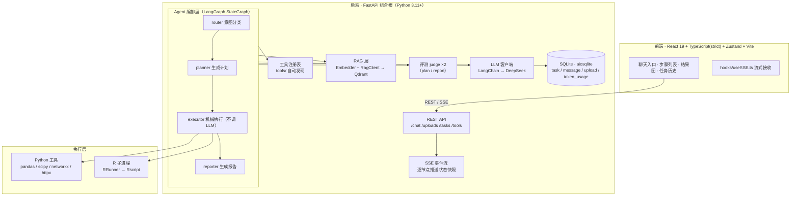

# Bio Agent

<p align="center">
  <a href="#"></a>
  <a href="#"></a>
  <a href="#"></a>
  <a href="#"></a>
  <a href="#"></a>
  <a href="#"></a>
</p>

> 一个面向**合成生物学 / 生物信息学**的多 agent 助手：用自然语言描述分析需求，agent 自动规划并执行一条分析管线（差异表达、富集、网络药理、单基因、生存分析……），全程**步骤可视化**、**可回溯**。
>
> 项目双重定位：**iGEM 参赛项目**（辅助队伍完成真实的生物数据分析）+ **AI Agent 求职作品集**（展示清晰的 multiagent 架构、干净的扩展机制、生产级工程实践）。

## 📌 当前进度

- **框架层已跑通**：LangGraph 四节点编排（router → planner → executor → reporter）、工具注册表自动发现、RAG 检索、评测（两个 judge）、SSE 事件流、SQLite 任务落库。
- **五条分析管线已实现**：单基因、差异表达、富集、网络药理、生存分析（详见 [分析管线](#-分析管线)）。
- **前端已上线**：聊天入口 + 步骤列表 + 结果图 + 任务历史，React 19 + TypeScript strict。
- **多轮对话已接入**：`conversation_id` 贯穿多次 task，历史上下文注入各 LLM 节点。
- **尚未实现**：Docker 一键部署、RAG 知识库离线 ingest 脚本、其余工具（机器学习 / 单细胞 / 空间转录组 / 虚拟扰动 / 文献检索）。

## ✨ 功能特性

### 🧠 清晰的 multiagent 编排

- **四个职责单一的节点**：`router` 判意图 → `planner` 出计划 → `executor` 机械执行 → `reporter` 写报告，而非「一个 prompt 大杂烩」。
- **管线裁剪**：router 判定的 `categories` 决定 planner 能看到的工具子集，工具清单不随工具总数膨胀。
- **executor 不调 LLM**：严格按 plan 分派 Python / R 工具，可预测、可测试。

### 🔌 「加工具 = 加一个文件」的扩展机制

- 新分析能力只需在 `backend/bioagent/tools/<category>/<tool_name>/` 丢一个 `ToolDefinition` 文件，**不改编排层**。
- 启动时 `pkgutil` 自动发现、自动注册；工具与 agent 完全解耦。

### 🧬 五条分析管线

| 工具名 | 类别 | 运行时 | 分析内容 | 结果图 |
|---|---|---|---|---|
| `single_gene_expression` | 单基因 | Python | 表达分布 + 组间 t 检验 | 箱线图 |
| `limma_dge` | 差异表达 | R (limma) | 差异表达表 | 火山图 |
| `go_kegg` | 富集 | R (clusterProfiler) | GO / KEGG 富集 | 条形图 |
| `ppi_network` | 网络药理 | Python (networkx + STRING) | 蛋白互作网络 | 网络图 |
| `km_cox` | 生存分析 | R (survival) | KM 曲线 + Cox 回归 | 生存曲线 |

### 🔍 可观测 · 可溯源

- **SSE 实时事件流**：每个节点状态实时推给前端，前端按类型增量渲染步骤列表。
- **任务完整落库**：任意一次运行的 plan / steps / report 持久化，历史可回看每一步、失败任务显示 `error`。
- **`correlation_id` 全链路溯源**：任何产出都能沿「用户消息 → 计划 → 步骤 → 报告」因果链回溯。
- **LangSmith 观测**：best-effort 上报，失败只记日志、不阻断主流程。

### 💬 多轮对话

- 一次对话（`conversation_id`）可跨多个 task；每轮成功后的 user/assistant 原子落 `message` 表，历史注入 router/planner/reporter 上下文。
- 前端「新对话」按钮一键重置对话。

### 🧪 评测锚点（两个 judge）

- **工具调用 judge**：评 planner 的 `plan`（工具选得对不对）。
- **报告 judge**：评 reporter 的 `report`。
- 按 `judge_sample_rate` 抽样触发，结果落 `eval_report` 表。

### 🌐 RAG 知识增强

- 本地 `sentence-transformers`（`all-MiniLM-L6-v2`）+ Qdrant 向量检索。
- 检索语料注入 planner（规划前）与 reporter（写报告前），增强分析的专业性。

## 🧭 系统架构



- 编排层不感知工具差异：Python 工具与 R 工具对外签名一致，按 `runtime` 分派。
- 工具、RAG、LLM、评测、DB 对编排层都是可注入依赖，测试可全 mock。

## 🚀 快速开始

### 环境

- **Python 3.11+**（后端）
- **Node.js 18+**（前端）
- **R + Rscript**（运行 dge / enrichment / survival 三个 R 工具时需要）
- **Qdrant**（RAG 向量库，启动时需可连接）

```bash
# 启动 Qdrant（如未运行）
docker run -p 6333:6333 qdrant/qdrant
```

### 后端

```bash
# 在项目根目录安装（可编辑模式，包在 backend/ 下）
pip install -e .

# 配置 API Key（写入 .env，已被 .gitignore 覆盖；默认 DeepSeek）
cp .env.example .env        # 然后编辑 .env 填入 DEEPSEEK_API_KEY

# 启动（默认 8000 端口）
python -m uvicorn bioagent.main:app --reload
```

首次启动会下载本地 embedding 模型 `all-MiniLM-L6-v2`，请保持网络可用。

### 前端

```bash
cd frontend
npm install
npm run dev        # Vite 开发服务器 5173，/chat /tasks /uploads /tools 自动转发到 8000
```

打开 http://localhost:5173 —— 上传表达矩阵 → 输入分析需求 → 实时看步骤推进与结果图。

## ⚙️ 配置

`config.yaml` 按块组织，启动时经 `load_config()` 加载：

| 块 | 说明 |
|---|---|
| `llm` | provider（`deepseek` / `openai` / `ollama`，其他 OpenAI 兼容服务配 `base_url`）+ model + key 环境变量名 |
| `embedding` | 本地 embedding 模型名 |
| `db` | SQLite 文件路径（`data/bioagent.db`） |
| `storage` | 上传文件目录 + R 脚本目录 |
| `rag` | Qdrant 地址 / collection 名 / `top_k` |
| `eval` | judge 抽样比例 `judge_sample_rate` |

密钥走环境变量（`.env`），默认 `DEEPSEEK_API_KEY`。

## 🛠 技术栈

| 层 | 技术 |
|---|---|
| 后端 | Python 3.11+ · FastAPI · LangChain · LangGraph · SQLite（aiosqlite）· sentence-transformers · Qdrant |
| 数据分析 | pandas · numpy · scipy · networkx · httpx（STRING API） |
| R | subprocess 调 `Rscript`（limma / clusterProfiler / survival） |
| 前端 | React 19 · TypeScript（strict）· Zustand · Vite · ECharts · Tailwind · react-markdown |
| 观测 | LangSmith（best-effort） |
| 质检 | ruff · pyright · pytest · eslint · vitest |

## 📖 文档

| 文档 | 内容 |
|---|---|
| [`docs/design/2026-08-22-synthbio-agent-design.md`](docs/design/2026-08-22-synthbio-agent-design.md) | 架构决策的唯一权威来源 |
| [`docs/specs/`](docs/specs/) | 每项功能的实现契约（spec 先行，01–17） |
| [`docs/test-inventory.md`](docs/test-inventory.md) | 测试清单（每次写测试后更新） |
| [`docs/how-testing.md`](docs/how-testing.md) | 测试策略 / 层级 / Mock 原则 |
| [`docs/how-security.md`](docs/how-security.md) | 安全约束（上传 / CORS / 密钥 / R 注入） |
| [`docs/LessonsLearned.md`](docs/LessonsLearned.md) | 经验教训 |

## ✅ 质量门

```bash
# 后端
python -m ruff check backend/bioagent backend/tests
python -m pyright backend/bioagent backend/tests
python -m pytest -q

# 前端
cd frontend
npm run lint
npm run typecheck
npm test
```

全部必须零报错。测试**不依赖真实 LLM / 真实 R 环境 / 真实文件系统**——LLM 注入 mock、R 子进程 mock、外部 API monkeypatch；测试验证管道正确性（输入走对流程、输出结构正确），不验证 LLM 文本质量。

## 📋 功能边界

- **本地单用户**：无端到端加密、无用户认证 / 多账户、无企业级审计日志。
- **无 agent 自造工具**：不做 code-interpreter 式运行时生成新工具，安全风险大、测试负担重。
- **无真实并发任务队列**：MVP 单任务即可，不做超长任务并发。
- **RAG 是硬依赖**：Qdrant 未启动时后端无法启动（检索是 planner/reporter 的硬依赖）；collection 为空只返回空列表，不阻断。
- **观测上报 best-effort**：LangSmith 上报失败只记日志跳过，不影响主流程正确性。
- **出站请求仅 LLM API + STRING（联网，opt-in）**，不上传用户数据。

## 🗺️ 路线图

1. ✅ 框架 + 五条分析管线 + 前端 + 多轮对话（当前）。
2. ⬜ Docker Compose 一键部署（前端 + 后端 + Qdrant）。
3. ⬜ RAG 知识库离线 ingest 脚本（合成生物学 / 生信文档入库）。
4. ⬜ 补全其余工具：机器学习、单细胞、空间转录组、虚拟扰动、文献检索。
