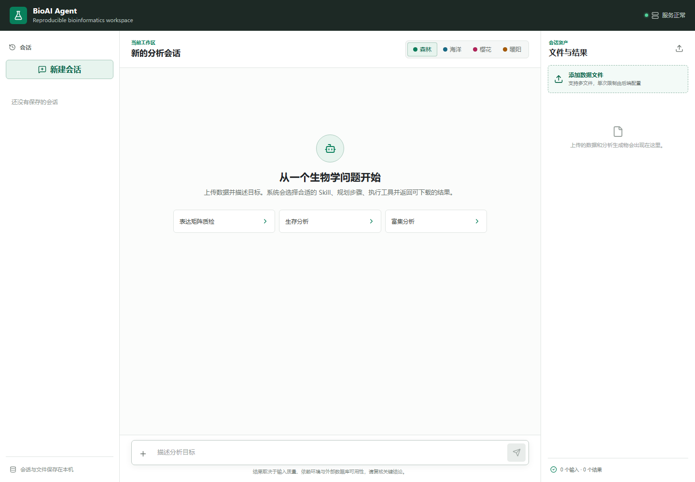

# BioAI Agent

[English documentation](README.en.md) · [iGEM submission guide](docs/IGEM_SUBMISSION.md) · [Contributing](CONTRIBUTING.md)

> 面向生物信息学与合成生物学领域的 AI 智能助手  
> 通过自然语言对话执行专业生信分析 —— 从数据上传到可视化全流程自动化

本项目是 [iGEM 2026 Team LZU GANSU](https://2026.igem.wiki/lzu-gansu) 的开源软件成果。
队伍的官方 iGEM GitLab 项目位于
[2026/lzu-gansu](https://gitlab.igem.org/2026/lzu-gansu)。

**版本**: 2.0 &nbsp;|&nbsp; **最后更新**: 2026-09-30



---

## 🔬 项目简介

BioAI Agent 是一个全栈 AI 应用，将大语言模型与生物信息学工具链深度整合。用户只需用自然语言描述需求（支持中文），系统即可自动完成文件识别、分析方案制定、R/Python 工具调用、结果报告生成的全流程。

适合生物信息学研究人员、合成生物学工程师，以及需要高效执行标准化生信分析的团队。

---

## ✨ 核心特性

- **Multi-Agent 架构** — Router → Planner → Executor → Reporter 流水线，全自动任务编排
- **YAML Skill 系统** — 54 条定义（22 个已实现、3 个部分实现、29 个规划中），覆盖 15 个类别
- **40 个注册工具** — 覆盖生存分析、差异表达、富集分析、机器学习、单细胞、空间转录组、扰动响应、文件处理与文献检索等
- **R 深度集成** — 子进程调用 Rscript，私有包库管理，无缝衔接 Bioconductor 生态
- **并行 + DEG 竞速** — 依赖感知并行执行，连续表达与 count 差异分析工具竞速
- **护栏机制** — 空转检测、熔断器、自动恢复策略，防止失控
- **斜杠命令** — 21 个快捷命令（`/survival` `/deg` `/scrna` `/spatial` `/perturb` 等）
- **Session Memory** — 跨轮次会话记忆，支持短回复解析
- **改进反馈** — 自动记录失败模式，支持人工触发分析并生成待审核建议；不会自动修改 Skill

---

## 📁 技术栈

| 层级 | 技术 |
|------|------|
| 后端框架 | FastAPI 0.135+ (Python 3.11-3.12) |
| ASGI 服务器 | Uvicorn |
| AI / LLM | DeepSeek API（OpenAI 兼容接口） |
| 数据库 | SQLite + SQLAlchemy 2.0 |
| R 集成 | subprocess + Rscript (R 4.2+) |
| 前端 | React + TypeScript + Vite（源码位于 `frontend/`，构建到 `backend/static/`） |
| 数据处理 | Pandas, NumPy, Scikit-learn, SciPy |
| 可视化 | Matplotlib, Seaborn (Python) + ggplot2 (R) |

---

## 🚀 快速开始

### 环境要求

- **Python** 3.11 / 3.12
- **R** 4.2 或更高版本
- **操作系统** Windows 10/11（正式支持）；后端有部分 POSIX 兼容代码，但尚未提供 Linux 安装脚本和 CI 保证

### 安装和启动

```batch
# 1. 检查环境
check_env.bat

# 2. 安装 R 依赖包（首次运行需要）
Rscript install_r_packages.R

# 3. 配置环境变量 —— 复制模板并填入你的 API Key
copy backend\.env_example backend\.env
# 编辑 backend\.env，将 DEEPSEEK_API_KEY 改为真实值

# 4. 启动应用
start_app.bat
```

应用默认在 `http://127.0.0.1:8000` 启动，浏览器自动打开。修改 `API_HOST` 或 `API_PORT` 后，启动脚本会使用新配置。

> ⚠️ `start_app.bat` 将自动创建虚拟环境、安装 Python 依赖、定位 Rscript，无需手动配置。

### 从源码构建前端

```bash
cd frontend
npm ci
npm run build
```

构建产物写入 `backend/static/`，FastAPI 会在根路径提供该 SPA。开发时运行
`npm run dev`，Vite 会把 `/api` 和 `/files` 代理到 `127.0.0.1:8000`。

逐项能力验证结果、真实执行证据和外部服务阻断记录见
[`docs/README_FEATURE_VERIFICATION.md`](docs/README_FEATURE_VERIFICATION.md)。外部数据库能力依赖
KEGG、MSigDB/Zenodo、STRING、Europe PMC 等服务的实时可用性；外部端点失败不会被记录为分析成功。

### 手动配置环境变量

如果不想使用启动脚本，手动创建 `backend/.env`：

```env
DEEPSEEK_API_KEY=sk-your-real-key-here
DEEPSEEK_BASE_URL=https://api.deepseek.com
MODEL_NAME=deepseek-chat
API_HOST=127.0.0.1
API_PORT=8000
```

---

## 🏗 系统架构

```
用户输入
  → 命令解析 (21 个斜杠命令)
  → Router Agent: 任务分类
  → Skill Select: 匹配 YAML Skill 定义并检查实现状态
  → Planner Agent: 制定执行计划
  → [Delegator]: 复杂任务拆分子 Agent
  → Executor Agent: 并行/竞速工具调用 + 护栏保护
  → Reporter Agent: 生成结构化中文报告
  → 返回 { reply, files }
```

### 能力状态

| 类别 | 代表功能 | 状态 |
|------|---------|------|
| 🔬 生存分析 | KM 曲线、Cox 回归、LASSO 预后模型 | 已实现 |
| 🧬 转录组 | DESeq2 / limma 差异表达、PCA | 已实现 |
| 🧪 富集分析 | GO / KEGG / GSEA | 已实现 |
| 🤖 机器学习 | Logistic、随机森林、SVM、LASSO 特征选择 | 已实现 |
| 🕸 网络药理学 | PPI 网络、STRING 数据库分析 | 已实现/部分实现 |
| 📚 文献检索 | PubMed 文献检索与开放获取 PDF | 已实现 |
| 🧬 单基因 | 表达、相关性、ROC 分析 | 已实现 |
| 📂 文件操作 | 多格式预览、已上传 GEO 文件导入 | 已实现/部分实现 |
| 🔧 系统 | R/Python 环境诊断 | 已实现 |
| 🔬 单细胞 | 单个 10X H5/ZIP 的 Seurat QC、标准化、PCA、聚类、UMAP、marker | 已实现 |
| 🗺 空间转录组 | 单个 Visium ZIP 的 QC、SCTransform、表达聚类和组织切片投影 | 已实现 |
| 🧲 扰动分析 | 目标基因表达缩放情景；真实对照/扰动样本的 DESeq2 或 limma 响应分析 | 已实现/部分实现 |

“规划中”的 Skill 会在进入 Planner/Executor 前停止，不会把底层函数误报为完整可用流程。

### 单细胞、空间与扰动的边界

- 单细胞标准流程接受当前会话上传的单个 10X `filtered_feature_bc_matrix.h5`，或只含一个完整 10X matrix/H5 数据集的 ZIP。当前不支持 h5ad、任意 CSV/TSV 计数矩阵、任意上传 RDS、多样本整合、细胞注释、拟时序或细胞通讯。
- Visium 标准流程接受只含一个完整 Space Ranger 输出的 ZIP，要求有 `filtered_feature_bc_matrix.h5`、空间坐标、`scalefactors_json.json` 和组织图像。输出是表达聚类在组织切片上的投影，不是空间感知聚类，也不包含反卷积。
- 表达缩放情景只把目标基因一行乘以 `1 - scaling_ratio`，不推断下游基因或通路，不能作为真实敲低/敲除预测。
- 真实扰动响应分析要求用户提供实际 control/perturbed 样本的表达矩阵和元数据；raw count 使用 DESeq2，连续表达使用 limma。结果是组间观测关联，不自动证明因果。
- GEARS、scGen、LINCS 自动下载、CRISPR 筛选建模等预测型虚拟扰动仍为规划能力。

---

## ⌨ 斜杠命令

| 命令 | 功能 | 状态 |
|------|------|------|
| `/survival` | 单基因生存分析 | 已实现 |
| `/cox` | 批量 Cox 回归 | 已实现 |
| `/lasso` | LASSO-Cox 模型 | 已实现 |
| `/risk` | 预后风险评分模型 | 已实现 |
| `/deg` | 差异表达（limma） | 已实现 |
| `/deseq2` | DESeq2 差异分析 | 已实现 |
| `/pca` | PCA 分析 | 已实现 |
| `/enrich` | GO/KEGG 富集 | 已实现 |
| `/gsea` | GSEA 预排序 | 已实现 |
| `/ml` | ML 二分类 | 已实现 |
| `/compare` | Logistic/RF/SVM 比较 | 已实现 |
| `/ppi` | PPI 网络 | 已实现 |
| `/netpharm` | 网络药理学 | 已实现 |
| `/probe` | 文件探测 | 已实现 |
| `/geo` | 已上传 GEO 文件导入与预览 | 部分实现 |
| `/lit` | 文献检索 | 已实现 |
| `/env` | 环境检测 | 已实现 |
| `/scrna` | 单个 10X 数据集的 Seurat 标准流程 | 已实现 |
| `/spatial` | Visium 表达聚类与组织切片投影 | 已实现 |
| `/perturb` | 真实对照组与扰动组的差异响应分析 | 已实现 |
| `/help` | 显示命令及实时实现状态 | 已实现 |

---

## 📂 项目结构

```
bio_test/
├── README.md
├── README.en.md               # English/iGEM-facing documentation
├── LICENSE                    # MIT open-source license
├── .gitlab-ci.yml             # Reproducibility and regression pipeline
├── start_app.bat              # 一键启动
├── check_env.bat              # 环境检测
├── requirements.txt           # Python 依赖
├── install_r_packages.R       # R 包安装
├── .gitignore                 # Git 忽略规则
│
├── backend/
│   ├── .env_example           # 环境变量模板
│   ├── static/                # 前端 SPA（Vite build）
│   ├── storage/               # 上传和生成文件
│   ├── db_data/               # SQLite 数据库
│   └── app/
│       ├── main.py            # FastAPI 入口
│       ├── api/               # REST API（chat / upload / history / system）
│       ├── agent/             # Multi-Agent + Skill + Rules + Hooks
│       │   └── skills/packs/  # 16 个 YAML 包、54 条 Skill 定义
│       ├── tools/             # 40 个已注册分析/系统工具
│       ├── services/          # 业务服务层
│       ├── db/                # ORM + CRUD + 审计日志
│       ├── schemas/           # Pydantic 模型
│       ├── core/              # 配置与路径管理
│       └── utils/             # 工具函数
│
├── env/r_libs/                # R 私有包库
├── frontend/                  # React/TypeScript/Vite 前端源码
├── logs/                      # 日志目录
├── docs/                      # 行为契约、修复计划与能力验证
└── runtime/                   # 运行时脚本
```

---

## 🛠 开发指南

### 新增工具

```python
from app.agent.tool_registry import register_tool
from app.agent.tool_result import make_error_result, make_success_result

@register_tool(
    name="my_analysis",
    description="自定义分析",
    category="survival",
    timeout=1800,
    max_memory_mb=8192,
)
def my_analysis(file_path: str, gene: str, threshold: float = 0.05):
    try:
        # ... 执行分析 ...
        return make_success_result(
            message="分析完成",
            output_files=[...],
            summary={"up": 150, "down": 80}
        )
    except Exception as e:
        return make_error_result(message=f"失败: {e}", errors=[str(e)])
```

### 新增 Skill

在 `backend/app/agent/skills/packs/` 下创建 YAML 文件即可自动加载：

```yaml
skills:
  - skill_id: my_skill
    name: "自定义技能"
    category: transcriptome
    trigger_keywords_cn: [自定义, 特殊分析]
    allowed_tools: [run_bulk_rnaseq_deg_analysis]
    max_tool_rounds: 12
    implementation_status: implemented
```

### 运行测试

```bash
# 首次安装开发测试依赖
.venv/Scripts/python.exe -m pip install -r requirements-dev.txt

# 工具返回协议测试
.venv/Scripts/python.exe backend/tests/test_tool_result.py

# 工具生命周期测试
.venv/Scripts/python.exe backend/tests/test_tool_lifecycle.py

# 工具注册测试
.venv/Scripts/python.exe backend/tests/test_tool_registration.py

# Skill 系统测试
.venv/Scripts/python.exe backend/tests/test_skill_system.py
.venv/Scripts/python.exe backend/tests/test_skill_packs.py

# ToolResult 快速冒烟测试
.venv/Scripts/python.exe backend/tests/test_integration.py

# 全量回归测试
.venv/Scripts/python.exe -m pytest -q backend/tests
```

---

## 📄 License

本项目以 [MIT License](LICENSE) 开源。第三方依赖仍分别适用其原始许可证，详见
[THIRD_PARTY_NOTICES.md](THIRD_PARTY_NOTICES.md)。

## 🧬 iGEM 队伍

- **队伍**：iGEM 2026 Team LZU GANSU
- **学校**：兰州大学（Lanzhou University）
- **官方队伍标识**：`lzu-gansu`
- **队伍 Wiki**：[https://2026.igem.wiki/lzu-gansu](https://2026.igem.wiki/lzu-gansu)
- **iGEM GitLab Wiki 项目**：[https://gitlab.igem.org/2026/lzu-gansu](https://gitlab.igem.org/2026/lzu-gansu)

软件专用 iGEM GitLab 仓库将在队伍通过官方 Software Deliverable 页面领取后补充。
个人贡献与指导教师信息以最终 Attributions Form 和队伍 Wiki 为准。
